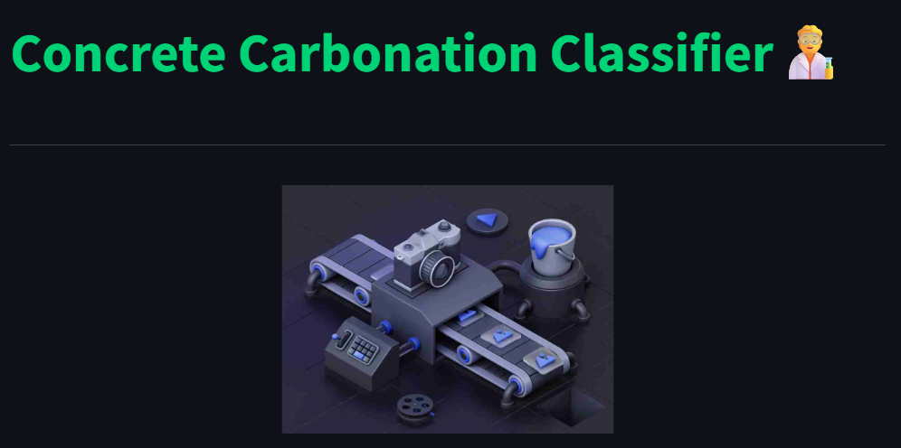

## Concrete Carbonation Classifier 🚧🧱🔍

<div align="center">




**An AI-powered, explainable image classifier for detecting carbonation damage in concrete samples**

Concrete Carbonation Classifier is a next-generation Streamlit web application that leverages deep learning to non-destructively assess carbonation damage in concrete from sample images. Designed for civil engineers and researchers, it provides instant, trustworthy predictions with an intuitive interface and explainable model outputs.

</div>

## ⚙️ Key Features  

- **🚀 Real-Time Classification**  
  Upload an image of a concrete sample and receive an instantaneous damage/no-damage verdict.  
- **🧠 Explainable AI**  
  Powered by a TensorFlow/Keras CNN model, offering transparent output probabilities and accuracy metrics.  
- **🔧 Modular Utilities**  
  Helper functions in `Utilities.py` manage page configuration, backgrounds, and Lottie animations.  
- **🎨 Engaging UI**  
  Built with Streamlit (v1.20+) for responsive layouts, custom sidebar branding, and Lottie animations via `streamlit_lottie`.  
- **🗄️ Lightweight & Secure**  
  Processes inputs in-memory only—no data is persisted on the server for maximum privacy.  
- **📦 Devcontainer Support**  
  Includes a VS Code Dev Container configuration for one-click setup of Python 3.11 development environments.

---

## 🏗️ Project Architecture
```
📦 Concrete_Carb_Classifier/
├── .devcontainer/
│   └── devcontainer.json           # DevContainer setup for reproducible dev env
├── Gifs/
│   └── Animation.json              # Lottie animation for UI feedback 
├── Images/
│   ├── side_bar_img.png            # Custom sidebar background 
│   ├── icon.webp                   # App icon & favicon 
│   ├── logotipo_SCyT.svg           # Institutional logos 
│   ├── logo_siiia_w.png
│   ├── UMSNH.png
│   └── Sample images/              # Preloaded test images for quick demos 
├── __pycache__/                    # Compiled Python caches
├── Central_app.py                  # Main Streamlit application script 
├── Utilities.py                    # Utility classes & functions (backgrounds, Lottie loader) 
├── carbonation_classifier_model.h5 # Pre-trained Keras CNN model weights 
├── requirements.txt                # Python dependencies (Streamlit, TensorFlow, etc.)
└── README.md                       # This documentation file 
```

---

## 💻 Technical Specifications  

### Prediction Model  
- **Framework**: TensorFlow 2.8+ / Keras  
- **Model File**: `carbonation_classifier_model.h5` (CNN architecture trained on labeled concrete images)  
- **Input Preprocessing**:  
  1. Images resized to 224×224 px  
  2. Pixel centering using `[123.68, 116.779, 103.939]` mean subtraction  
- **Inference Logic**:  
  - Probability ≤ 0.22 → “No carbonation detected”  
  - Probability > 0.22 → “Carbonation damage detected”

### User Interface  
- **Framework**: Streamlit 1.20+  
- **Animations**: Lottie via `streamlit_lottie`  
- **Styling**: Custom sidebar backgrounds and logos embedded with Markdown/HTML  
- **Security**: Simple password protection (default code: `concrete2025`) on sidebar  

---

## ⚙️ Installation & Setup  

### System Requirements  
| Component | Minimum     | Recommended  |
|-----------|-------------|--------------|
| **Python**| 3.8+        | 3.10+        |
| **RAM**   | 4 GB        | 8 GB+        |
| **OS**    | Windows/Linux/macOS | —   |

### Clone & Install  
```bash
# 1. Clone the repo
git clone https://github.com/JoseAlbertoGT/Concrete_Carb_Classifier.git
cd Concrete_Carb_Classifier

# 2. (Optional) Use Dev Container
#    Open in VS Code and click “Reopen in Container”

# 3. Install dependencies
pip install -r requirements.txt

# 4. Run the app
streamlit run Central_app.py
```
## :abacus: Methodology & Algorithms

### :books: Machine Learning Pipeline

1. **Data Collection**: High-resolution photographs of concrete specimens with known carbonation states.
2. **Image Preprocessing**: Resize, center‐crop, and pixel-value normalization based on ImageNet means.
3. **Model Training**: Fine-tuned CNN in Keras with binary cross-entropy loss.
4. **Deployment**: Model weights loaded at runtime in a Streamlit interface for inference.
5. **Explainability**: Confidence thresholds and clear color–coded messaging to assist non-expert users.

### :trophy: Why Concrete Carbonation Classifier?

| Feature         | Traditional Methods    | ConcreteCarbClass API    |
|-----------------|-----------------------|---------------------------|
| **Speed**       | Visual inspection     | Instant verdict           |
| **Accuracy**    | Subjective            | Objective                 |
| **Explainability** | Limited            | Transparent, interactive  |
| **Accessibility** | Specialist required | Anyone, anywhere          |
| **Scalability** | Static                | Easily updatable          |
---
## :scientist: Research Team

### :man_scientist: Principal Researchers

<table>
<tr>
<td width="33%">

**Dr. José Alberto Guzmán Torres** :mexico:
- :office: [SIIIA MATH: Soluciones en ingeniería](http://www.siiia.com.mx)
- :classical_building: [Universidad Michoacana de San Nicolás de Hidalgo](http://www.umich.mx)
- :microscope: Engineering applications & Artificial Intelligence
- :email: jose.alberto.guzman@umich.mx
- :globe_with_meridians: [ORCID](https://orcid.org/0000-0002-9309-9390)

</td>
<td width="33%">

**Dr. Francisco Javier Domínguez Mota** :mexico:
- :office: [SIIIA MATH: Soluciones en ingeniería](http://www.siiia.com.mx)
- :classical_building: [Universidad Michoacana de San Nicolás de Hidalgo](http://www.umich.mx)
- :microscope: Applied Mathematics & Finite Difference Methods
- :email: francisco.mota@umich.mx
- :globe_with_meridians: [ORCID](https://orcid.org/0000-0001-6837-172X)

</td>
<td width="33%">

**Dr. Gerardo Tinoco Guerrero** :mexico:
- :office: [SIIIA MATH: Soluciones en ingeniería](http://www.siiia.com.mx)
- :classical_building: [Universidad Michoacana de San Nicolás de Hidalgo](http://www.umich.mx)
- :microscope: Numerical Methods & Computational Mathematics
- :email: gerardo.tinoco@umich.mx
- :globe_with_meridians: [ORCID](https://orcid.org/0000-0003-3119-770X)

</td>
</tr>
</table>
---

## :books: Scientific References

### :books: Core Publications

1. **Guzmán-Torres, J. A.**, Domínguez-Mota, F. J., Tinoco-Guerrero, G., Tinoco-Ruíz, J. G., & Alonso-Guzmán, E. M. (2024). *Extreme fine-tuning and explainable AI model for non-destructive prediction of concrete compressive strength, the case of ConcreteXAI dataset.* **Advances in Engineering Software**, 192, 103630. [DOI: 10.1016/j.advengsoft.2024.103630](https://doi.org/10.1016/j.advengsoft.2024.103630)

2. Guzmán-Torres, J. A., Domínguez-Mota, F. J., Alonso-Guzmán, E. M., Tinoco-Guerrero, G., & Martínez-Molina, W. (2024). ConcreteXAI: A multivariate dataset for concrete strength prediction via deep-learning-based methods. Data in Brief, 53, 110218. [DOI: 10.1016/j.dib.2024.110218](https://doi.org/10.1016/j.dib.2024.110218)

---

## :bookmark_tabs: License

MIT License

Copyright (c) 2025 José A. Guzmán-Torres

Permission is hereby granted, free of charge, to any person obtaining a copy
of this software and associated documentation files (the "Software"), to deal
in the Software without restriction, including without limitation the rights
to use, copy, modify, merge, publish, distribute, sublicense, and/or sell
copies of the Software, and to permit persons to whom the Software is
furnished to do so, subject to the following conditions:

The above copyright notice and this permission notice shall be included in all
copies or substantial portions of the Software.

THE SOFTWARE IS PROVIDED "AS IS", WITHOUT WARRANTY OF ANY KIND, EXPRESS OR
IMPLIED, INCLUDING BUT NOT LIMITED TO THE WARRANTIES OF MERCHANTABILITY,
FITNESS FOR A PARTICULAR PURPOSE AND NONINFRINGEMENT. IN NO EVENT SHALL THE
AUTHORS OR COPYRIGHT HOLDERS BE LIABLE FOR ANY CLAIM, DAMAGES OR OTHER
LIABILITY, WHETHER IN AN ACTION OF CONTRACT, TORT OR OTHERWISE, ARISING FROM,
OUT OF OR IN CONNECTION WITH THE SOFTWARE OR THE USE OR OTHER DEALINGS IN THE
SOFTWARE.


---
## :email: Contact & Support

### :busts_in_silhouette: Research Group Contact

**Primary Contact:**
- **Dr. José Alberto Guzmán Torres**
  - :email: jose.alberto.guzman@umich.mx
- :office: Research Group: SIIIA MATH – Soluciones en Ingeniería
- :classical_building: Institution: Facultad de Ingeniería Civil, UMSNH
- :technologist: Technical Issues: Report bugs or request features via GitHub Issues

### :question: Technical Support

For technical questions and issues:
1. **Email Support**: Contact the research team directly for complex technical inquiries
2. **Academic Collaboration**: Reach out for research partnerships and joint projects

### :mortar_board: Student Inquiries

Interested in graduate research opportunities?
- **Contact**: Dr. José Alberto Guzmán Torres (jose.alberto.guzman@umich.mx)
- **Topics**: Machine Learning, Deep Learning, Computer vision applications
- **Institution**: Universidad Michoacana de San Nicolás de Hidalgo

### :globe_with_meridians: Institutional Affiliations

- **SIIIA MATH**: [Soluciones en ingeniería](http://www.siiia.com.mx)
- **UMSNH**: [Universidad Michoacana de San Nicolás de Hidalgo](http://www.umich.mx)

---

<div align="center">

**:star: ⭐ If this tool enhances your research or teaching, please ⭐ **star** this repository!
</div>


